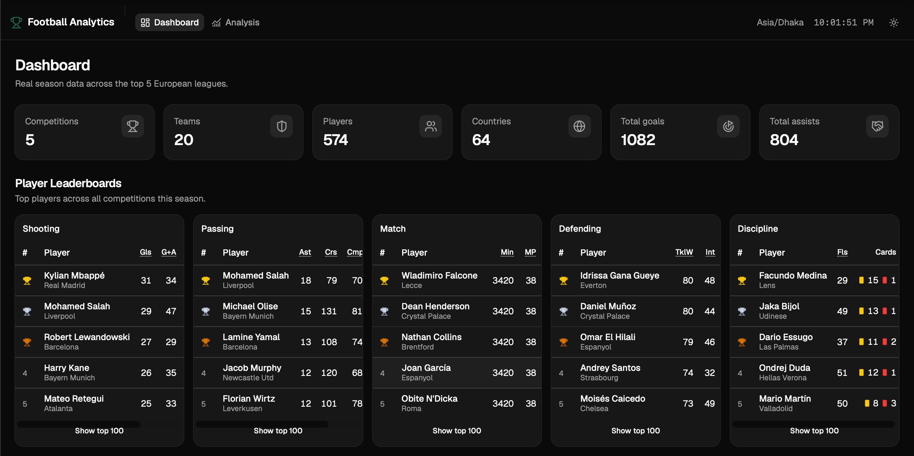
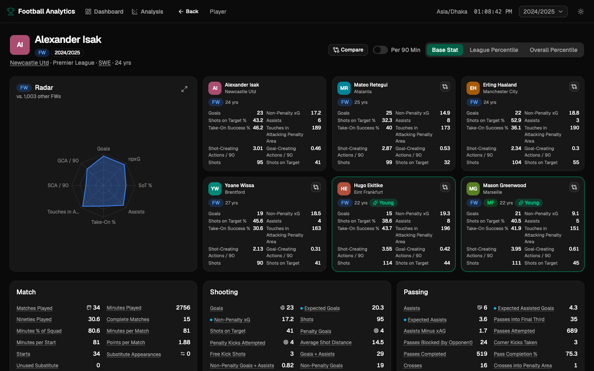
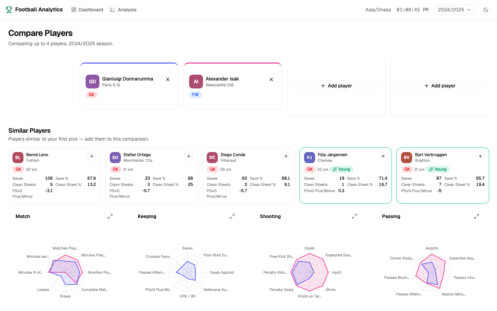
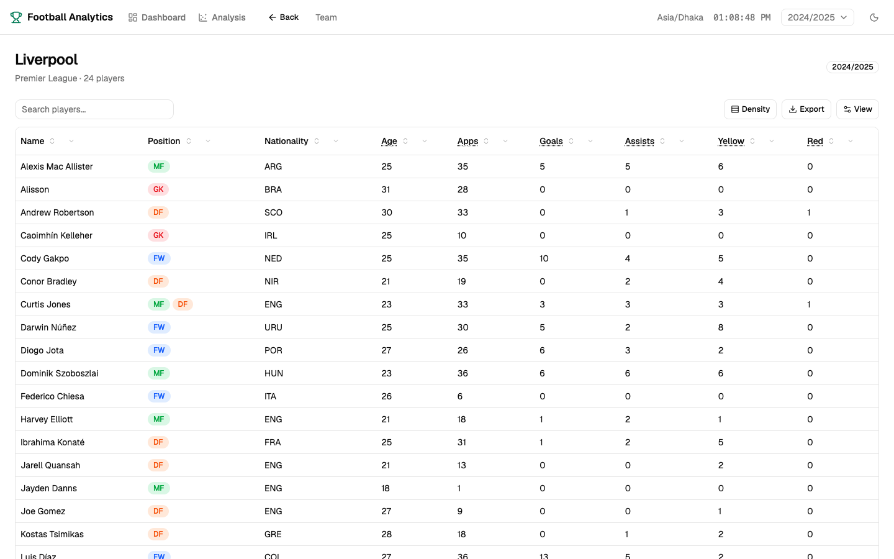
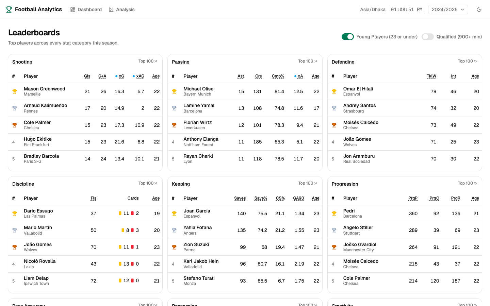
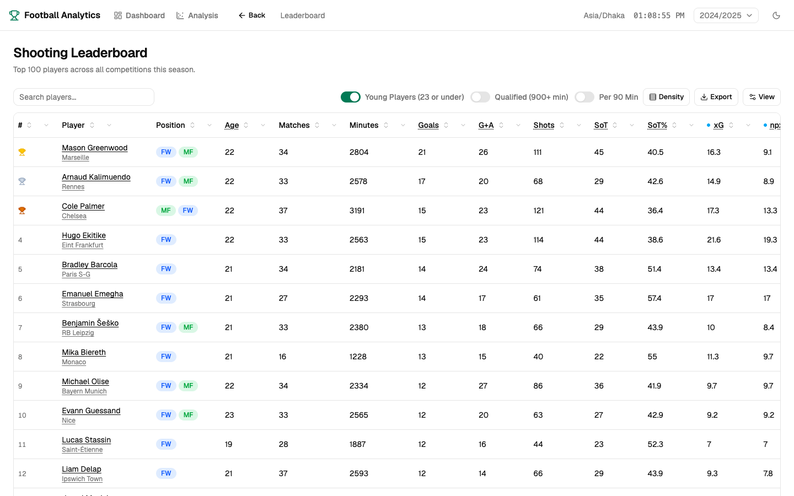
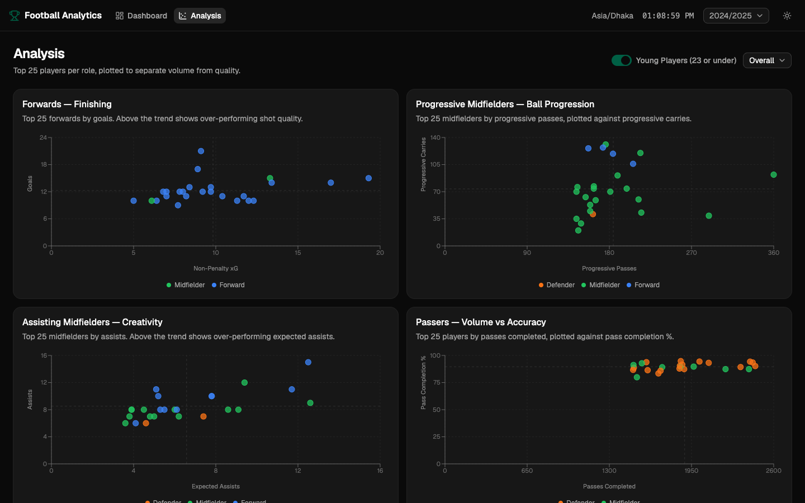
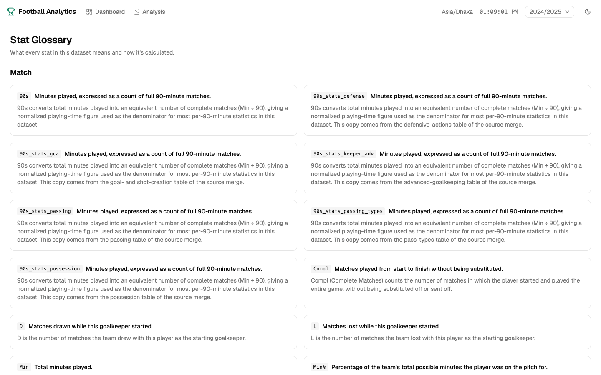

# Football Player Stats Dashboard

A multi-season (2024-25 and 2025-26) football/soccer player statistics
explorer — browse teams, players, and countries across the top 5 European
leagues, compare up to 4 players head-to-head with radar charts, discover
similar players and rising young talent on every profile, drill into 9
category leaderboards, explore role-based scatter charts on the Analysis
page, and look up every stat's meaning in a built-in glossary. Backend is
FastAPI + Polars, frontend is React + TanStack Router/Query/Table + shadcn/ui.

## Screenshots

<!-- Drop PNGs into docs/screenshots/ using the filenames below and they'll render here automatically. See docs/screenshots/README.md for the full convention. -->

|                                                                                              |                                                                    |
| --------------------------------------------------------------------------------------------- | -------------------------------------------------------------------- |
|                                                |  |
|  |                   |
|  |  |
|  |                     |

## Features

- **Season & competition switching** — every page scopes its data to the
  selected season (2024-25 / 2025-26) and competition; switching either
  re-fetches everything downstream.
- **Dashboard** — headline stat cards, a sortable team table and a country
  table for the selected competition/season, plus a 5-card leaderboard
  preview with a "See All" link through to the full Leaderboards page.
- **Team, player, and country detail pages** — full rosters, player profiles
  grouped into stat cards (Match, Shooting, Passing, Creation, Possession,
  Discipline, Keeping, Defending), reached by clicking through from the
  dashboard. Player positions are colour-coded (GK red, defenders orange,
  midfielders green, forwards blue) for fast scanning of rosters and
  leaderboards.
- **Position radar charts** — every player detail page renders a radar chart
  per position the player has played (one per position for multi-position
  players), scoring 6-8 curated stats against every other player at that
  position, with a sample-size caption (e.g. "vs. 1,003 other FWs") and an
  expand-to-fullscreen view.
- **Similar Players & Young Talents** — next to the radar chart, every player
  detail page lays out a 3x2 grid of position-matched comps: the viewed
  player's own major-stats card (their top 10 stats for their primary
  position — Saves leads for keepers, Goals for forwards, and so on) plus the
  5 closest matches by stat similarity, spanning any age and age-23-or-under
  specifically (highlighted with a green ring and a "Young" badge rather than
  a separate section). Each comp card has a one-click icon button through to
  a head-to-head Compare with the viewed player.
- **Compare Players** (`/compare`) — pick up to 4 players and see them
  overlaid on the same radar charts and an "Overall" table (Base Stat /
  League Percentile / Overall Percentile tabs, highlighting the better value
  in green for every stat), both ordered Match first followed by each
  compared player's signature category — Keeping for a keeper, Shooting for a
  forward, Defending for a defender, Passing for a midfielder — so the most
  position-relevant stats surface before the rest. Arriving here from a
  player's Similar Players card pre-fills both players and surfaces the rest
  of that player's comps in a side panel with one-click "+" buttons to add
  them, up to the 4-player cap.
- **Base Stat / League Percentile / Overall Percentile views** — player
  detail and comparison pages can switch between raw stat values and a
  percentile rank against the rest of the league or the whole dataset,
  colour-graded from red (bottom) through white (50th) to green (top), so a
  player's strengths and weaknesses jump out at a glance.
- **Per 90 Min toggle** — the player detail page and every leaderboard can
  flip all countable stats (goals, tackles, cards, ...) to their
  per-90-minutes rate on the fly, so playing time doesn't skew comparisons
  between players; rate stats that are already normalized (percentages,
  averages, `/90` stats) are left untouched, and sorting a leaderboard
  column respects whichever mode is active.
- **Leaderboards** (`/leaderboards`) — 9 category leaderboards (Shooting,
  Passing, Defending, Discipline, Keeping, Progression, Pass Accuracy,
  Possession, Creativity) with sortable, hideable columns via a shared
  `DataTable` component and a "Top 100" full-table view per category. A
  "Qualified (900+ min)" toggle filters out small-sample outliers on
  rate-based categories like Keeping's Save% or Pass Accuracy's Cmp%, and a
  "Young Players (23 or under)" toggle filters every category down to
  emerging talent and adds an Age column for scouting at a glance.
- **Analysis** (`/analysis`) — 6 role-based scatter charts (Forwards'
  finishing, Progressive & Assisting Midfielders, Passers, Defenders,
  Keepers) plotting the Top 25 players per role on two related stats (e.g.
  npxG vs. Goals) to separate volume from quality, with dashed
  average-reference lines splitting each chart into quadrants, a
  position-colour-coded legend, a competition filter (defaulting to
  "Overall" across all leagues) next to the page title, and the same "Young
  Players (23 or under)" toggle as Leaderboards, which also adds each
  player's age to the hover tooltip.
- **Advanced-stat highlighting** — expected-value metrics (xG, xAG, xA, GCA,
  SCA, PSxG, ...) are visually flagged wherever they appear, since they're
  only available for seasons whose source data includes them.
- **Stat glossary** — every column gets a short and long description, sourced
  from `backend/datasets/stat-type.json` and surfaced as tooltips throughout
  the app.

## Tech stack

**Backend** (`backend/`, Python ≥3.14, managed by [uv](https://docs.astral.sh/uv/)):
FastAPI, Polars, Pandas/PyArrow, mplsoccer + Matplotlib for plotting,
pydantic-settings for config. Tests via pytest, linting via ruff.

**Frontend** (`frontend/`, Vite): React 19, TanStack Router (file-based
routing + typed search params), TanStack Query, TanStack Table, shadcn/ui on
Base UI, Tailwind CSS v4, Recharts, lucide-react.

## Project structure

```
backend/
  app/
    main.py            FastAPI app instance, CORS, router registration
    config.py           pydantic-settings config, loaded from root .env
    sample_data.py       Multi-season data loading (season -> CSV map, cached)
    dataset_loader.py    CSV/Excel/SQLite readers for backend/datasets/
    analytics/           Pure Polars functions: DataFrame in, dict/DataFrame out
    plots/                mplsoccer figure builders + shared theme
    api/routes/           Thin FastAPI route handlers
  datasets/               Season CSVs + stat-type.json (gitignored, see below)
  tests/                  pytest suite
frontend/
  src/
    routes/               TanStack Router file-based routes
    components/            ui/ (shadcn), layout/, data-table/, cards/, leaderboard/, stat/
    lib/                    cn(), nav config, season/search-param helpers
    hooks/                  useStatGlossary, useLocalStorageState, etc.
    types/                  Ambient TS declarations
docs/
  SETUP.md                 Full setup walkthrough (no database)
  SETUP_WITH_DB.md          How to add persistence later
  screenshots/              README screenshots live here
```

## Getting started

Full step-by-step instructions (prerequisites, verification checklist) are in
[docs/SETUP.md](docs/SETUP.md). In short:

```bash
npm run setup   # installs backend (uv) and frontend (npm) dependencies
cp .env.example .env
npm run dev     # runs both dev servers, colour-prefixed, one command
```

Then open http://localhost:5173.

### Getting the season data

The season CSVs (`backend/datasets/players_data-2024_2025.csv`,
`backend/datasets/players_data-2025_2026.csv`) and the generated
`stat-type.json` glossary are **gitignored** — a fresh clone starts with no
data. See [backend/datasets/README.md](backend/datasets/README.md) for the
expected file format; drop your own season CSVs in that folder to bring the
app to life.

For a persistence layer beyond flat CSVs, see
[docs/SETUP_WITH_DB.md](docs/SETUP_WITH_DB.md).

## License

[MIT](LICENSE)
